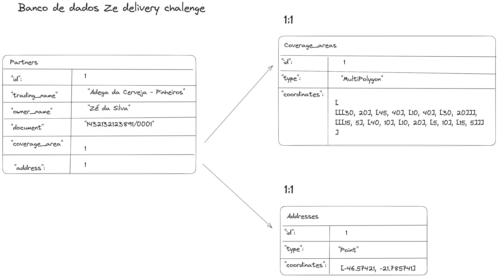

# Ze-Delivery-chalenge

Desafio de back-end do Zé Delivery, você pode verificar as intruções do desafio no arquivo [backend.md](backend.md) presente nesse repositório.

Para mais desafios como esse acesse (https://github.com/ZXVentures/ze-code-challenges)

## Fase atual:
  Estrutura definida, criando banco de dados e populando.


## Para rodar em sua máquina:

Clone esse repositório:
```bash
git clone git@github.com:nelsonhamada/ze-delivery-chalenge.git
```

Entre no diretório raiz:

```bash
cd ze-delivery-chalenge
```

Instale as dependências do projeto:

```bash
npm install
```

Inicie os containers do banco de dados e backend:

```bash
docker-compose up -d --build
```

Caso tenha conflitos com portas já usadas. Use os comandos:

```bash
killall node # Parar qualquer aplicação node que esteja sendo executados na máquina.
docker stop $(docker ps -qa) # Para containers que estão sendo executados.
```

### Rodar testes unitários

```bash
npm test
```
> Nota: O comando poder ser executado tanto dentro quanto fora do container.


## Estrutura do Banco de dados:


